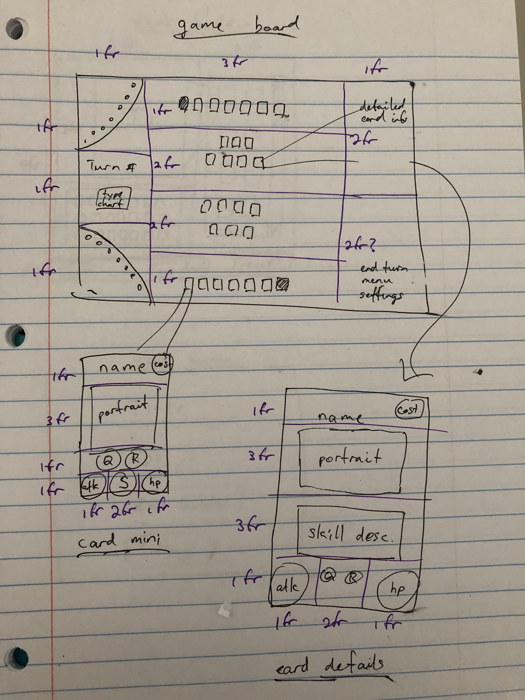
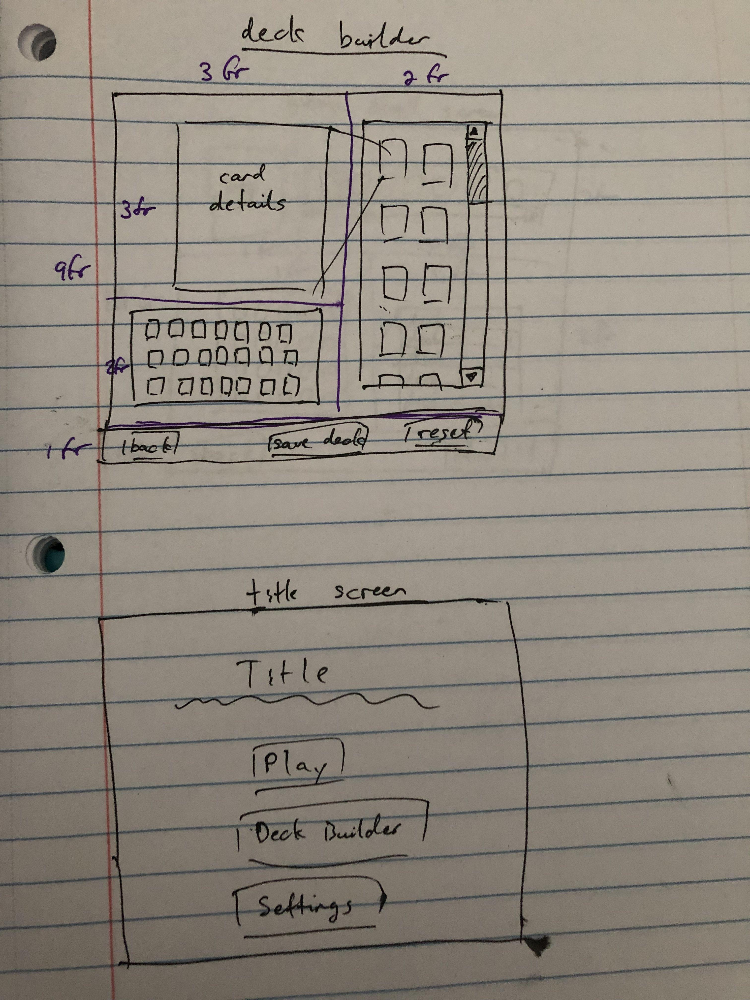

# Vantage Masters Revisited
Based off of my original Vantage Masters project from back in the day, this capstone will create an even better port of Vantage Masters and so has several key aims:
- Completely refactor the front end to use React instead of pure DOM manipulation.
  - May be best to redesign the UI to use mouseclicks instead of dragging and dropping; alternately, something like [`react-dnd`](https://react-dnd.github.io/react-dnd/about) could be a solution if it seems time-efficient to learn and implement.
  - Move all actual functionality, calculation, etc. to the back end.
- Rewrite the front end in Typescript.
- Create a help page that explains the game instead of having it all in the readme.
- Implement the originally desired deck builder and incorporate it smoothly into an account system.

# Planning
## User Stories
As a user, I would like to:
- play the Vantage Masters game as it exists in Trails of Cold Steel IV, with all natials and spells.
  - This is admittedly pretty broad, but essentially boils down to "the new app should be able to do everything gameplay-wise that the previous Vantage Masters could do", which is already fairly well defined (since the app already exists).
- use Natials with aura abilities and have them work correctly (a bugfix from the previous version).
- play a game of Vantage Masters against a computer opponent, using some prebuilt decks (ie. the seed data).
- create an account, which will offer me several benefits if I log in:
  - I can resume a game from where I left off, instead of losing the entire game state if I close my browser or shut down my computer.
  - I can create new decks, save them to my account, delete them, favorite them, and enter Vantage Masters games with them.
    - I can only save decks if they are actually valid Vantage Masters decks (exactly one Master, no more than 20 other cards, etc).
  - I can delete the prebuilt decks.
  - I can see my play history, my overall win/loss ratio, and my win/loss ratio with each deck.
  - I can change my password and log out.

## Wireframes
These are the old wireframes, I'm sorry! I just moved out of the hotel and I can't find anything to write or draw with -- I think my notebooks and pens are still in storage. The fundamental features are not especially different, so these wireframes should still be accurate for the mosts part.

Board and card wireframes (can model based on the existing CSS as well)

Deck builder and title screen
